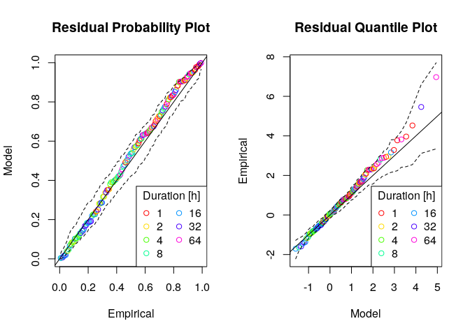
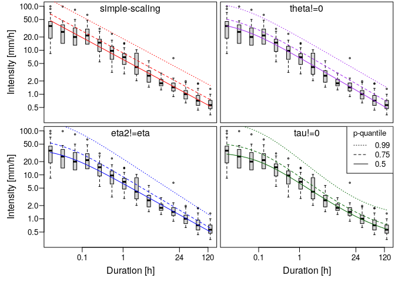

<!-- README.md is generated from README.Rmd. Please edit that file -->

# IDF

<!-- badges: start -->
<!-- badges: end -->

Intensity-duration-frequency (IDF) curves are a widely used
analysis-tool in hydrology to assess the characteristics of extreme
precipitation. The package ‘IDF’ functions to estimate IDF relations for
given precipitation time series on the basis of a duration-dependent
generalized extreme value (GEV) distribution. The central function is ,
which uses the method of maximum-likelihood estimation for the d-GEV
parameters, whereby it is possible to include generalized linear
modeling for each parameter. For more detailed information on the
methods and the application of the package for estimating IDF curves
with spatial covariates, see Ulrich et. al (2020,
<https://doi.org/10.3390/w12113119>).

## Installation

You can install the released version of IDF from
[CRAN](https://CRAN.R-project.org) with:

``` r
install.packages("IDF")
```

or from gitlab using:

``` r
devtools::install_git("https://gitlab.met.fu-berlin.de/Rpackages/idf_package")
```

## Example

Here are a few examples to illustrate the order in which the functions
are intended to be used.

-   Step 0: sample 20 years of example hourly ‘precipitation’ data

``` r
set.seed(999)
dates <- seq(as.POSIXct("2000-01-01 00:00:00"),as.POSIXct("2019-12-31 23:00:00"),by = 'hour')
sample.precip <- rgamma(n = length(dates), shape = 0.05, rate = 0.4)
precip.df <- data.frame(date=dates,RR=sample.precip)
```

-   Step 1: get annual maxima

``` r
library(IDF)

durations <- 2^(0:6) # accumulation durations [h] 
ann.max <- IDF.agg(list(precip.df),ds=durations,na.accept = 0.1)
# plotting the annual maxima in log-log representation
plot(ann.max$ds,ann.max$xdat,log='xy',xlab = 'Duration [h]',ylab='Intensity [mm/h]')
```


-   Step 2: fit d-GEV to annual maxima

``` r
fit <- gev.d.fit(xdat = ann.max$xdat,ds = ann.max$ds,sigma0link = make.link('log'))
#> $conv
#> [1] 0
#> 
#> $nllh
#> [1] 59.34496
#> 
#> $mle
#> [1]  6.478887e+00  3.817184e-01 -1.833254e-02  2.843666e-09  7.922310e-01
#> 
#> $se
#> [1] 0.25207846 0.02370771 0.04861600        NaN 0.01008561
# checking the fit 
gev.d.diag(fit,pch=1,ci=TRUE)
```



``` r
# parameter estimates 
params <- gev.d.params(fit)
print(params)
#>        mut sigma0          xi        theta      eta eta2 tau
#> 1 6.478887 1.4648 -0.01833254 2.843666e-09 0.792231    0   0

# plotting the probability density for a single duration 
q.min <- floor(min(ann.max$xdat[ann.max$ds%in%1:2]))
q.max <- ceiling(max(ann.max$xdat[ann.max$ds%in%1:2]))
q <- seq(q.min,q.max,0.2)
plot(range(q),c(0,0.55),type = 'n',xlab = 'Intensity [mm/h]',ylab = 'Density')
for(d in 1:2){ # d=1h and d=2h
  # sampled data:
  hist(ann.max$xdat[ann.max$ds==d],main = paste('d=',d),q.min:q.max
       ,freq = FALSE,add=TRUE,border = d)   
  # etimated prob. density:
  lines(q,dgev.d(q,params$mut,params$sigma0,params$xi,params$theta,params$eta,params$tau,d = d),col=d) 
}
legend('topright',col=1:2,lwd=1,legend = paste('d=',1:2,'h'),title = 'Duration')
```


-   Step 3: adding the IDF-curves to the data

``` r
plot(ann.max$ds,ann.max$xdat,log='xy',xlab = 'Duration [h]',ylab='Intensity [mm/h]')
IDF.plot(durations,params,add=TRUE)
```


## IDF Features

This Example depicts the different features that can be used to model
the IDF curves, see Fauer et. al (2021,
<https://doi.org/10.5194/hess-25-6479-2021>). Here we assume, that the
block maxima of each duration can be modeled with the GEV distribution
():

![G(z;\\mu,\\sigma,\\xi)=\\exp \\left\\lbrace -\\left\[ 
1+\\xi \\left( \\frac{z-\\mu}{\\sigma} \\right)
\\right\]^{-1/\\xi} \\right\\rbrace,](https://latex.codecogs.com/png.latex?G%28z%3B%5Cmu%2C%5Csigma%2C%5Cxi%29%3D%5Cexp%20%5Cleft%5Clbrace%20-%5Cleft%5B%20%0A1%2B%5Cxi%20%5Cleft%28%20%5Cfrac%7Bz-%5Cmu%7D%7B%5Csigma%7D%20%5Cright%29%0A%5Cright%5D%5E%7B-1%2F%5Cxi%7D%20%5Cright%5Crbrace%2C "G(z;\mu,\sigma,\xi)=\exp \left\lbrace -\left[ 
1+\xi \left( \frac{z-\mu}{\sigma} \right)
\right]^{-1/\xi} \right\rbrace,")

where the GEV parameters depend on duration according to:

=\sigma_0(d+\theta)^{-\eta_2}+\tau, \\
\mu(d) = \tilde{\mu}\cdot\sigma_0(d+\theta)^{-\eta}+\tau,  \\
\xi(d) = \text{const.} 
")

The function `gev.d.fit` provides the options:

-   `theta_zero = TRUE`
    
-   `eta2_zero = TRUE` (default)
    
-   `tau_zero = TRUE` (default)
    

resulting in the following features for IDF-curves:

-   simple scaling: using only parameters
    
-   curvature for small durations: allowing
    
    (default)
-   multi-scaling: allowing
    
-   flattening for long durations: allowing
    .

Example:

``` r
### sampling example data
set.seed(42)
# durations
ds <- 1/60*2^(seq(0,13,1))
# random data for each duration
xdat <- sapply(ds,rgev.d,n = 20,mut = 2,sigma0 =3,xi = 0.2,theta = 0.1,eta = 0.6,tau = 0.1,eta2 = 0.2)
# transform to data.frame
example <- data.frame(xdat=as.numeric(xdat),ds=rep(ds,each=dim(xdat)[1]))

### different fit options
fit.simple <- gev.d.fit(xdat=example$xdat,ds = example$ds,theta_zero = TRUE,show=FALSE)
fit.theta <- gev.d.fit(xdat=example$xdat,ds = example$ds,show=FALSE)
fit.eta2 <- gev.d.fit(xdat=example$xdat,ds = example$ds,eta2_zero = FALSE,show=FALSE)
fit.tau <- gev.d.fit(xdat=example$xdat,ds = example$ds,eta2_zero = FALSE,tau_zero = FALSE,show=FALSE)
# group fits
all.fits <- list(simple=fit.simple,curvature=fit.theta,multiscaling=fit.eta2,flattening=fit.tau)
# compare parameter estimates:
print(t(sapply(all.fits,gev.d.params)))
#>              mut      sigma0   xi           theta      eta       eta2     
#> simple       1.754974 2.897875 -0.004559432 0          0.4978471 0        
#> curvature    1.782777 3.187756 -0.01039414  0.02949747 0.5376237 0        
#> multiscaling 1.896368 2.826447 0.1358611    0.03034914 0.4971133 0.1577612
#> flattening   2.038391 2.712067 0.1469354    0.09235748 0.6237206 0.2642782
#>              tau      
#> simple       0        
#> curvature    0        
#> multiscaling 0        
#> flattening   0.1287691

### compare resulting idf-curves
fit.cols <- c('red','purple','blue','darkgreen')
fit.labels <- c('simple-scaling','theta!=0','eta2!=eta','tau!=0')
# plotting probabilities
idf.probs <- c(0.5,0.75,0.99) 
# create 4 plots: one for each additional parameter
par(mfrow=c(2,2),mar=c(0.2,0.2,0.2,0.2),oma=c(3.5,4.5,0,0),mgp=c(2.5,0.6,0))
for(i.fit in 1:length(all.fits)){
  plot(example$ds,example$xdat,log='xy',type='n',axes=FALSE)
  box()
  boxplot(example$xdat~example$ds,at=ds,add = TRUE,
        boxwex=0.2,cex=0.4,axes=FALSE)
  if(i.fit %in% c(1,3)){
    axis(2,las=2)
    mtext('Intensity [mm/h]',2,3)
  }
  if(i.fit %in% 3:4){
    axis(1,at=c(0.1,1,24,120),labels = c(0.1,1,24,120))
    mtext('Duration [h]',1,2)
  }
  for(i.p in 1:length(idf.probs)){
    # plotting IDF curves for each model (different colors) and probability (different lty)
    IDF.plot(1/60*2^(seq(0,13,0.5)),gev.d.params(all.fits[[i.fit]]),probs = idf.probs[i.p]
             ,add = TRUE,legend = FALSE,lty = i.p,cols = fit.cols[i.fit])
  }
  mtext(fit.labels[i.fit],3,-1.25)
}
legend('topright',lty=rev(1:3),legend = rev(idf.probs),title = 'p-quantile')
```


