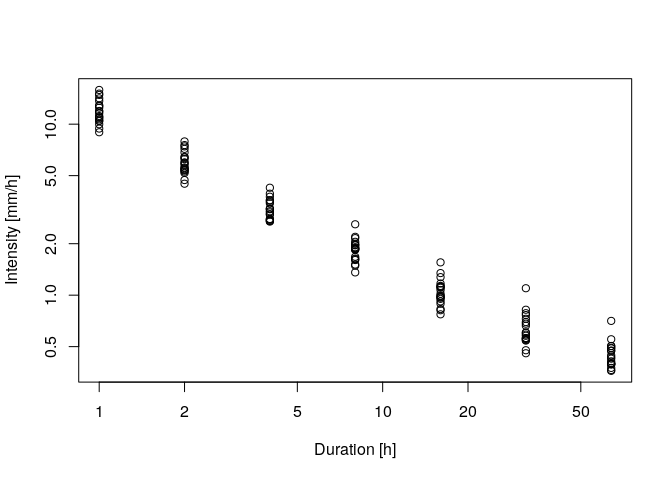
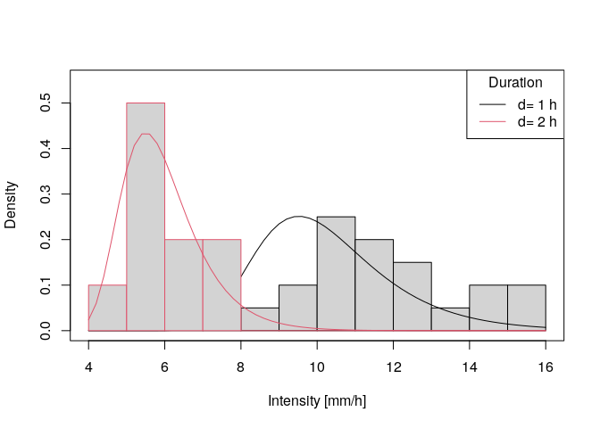

<!-- README.md is generated from README.Rmd. Please edit that file -->

# IDF

<!-- badges: start -->

<!-- badges: end -->

Intensity-duration-frequency (IDF) curves are a widely used
analysis-tool in hydrology to assess the characteristics of extreme
precipitation. The package ‘IDF’ functions to estimate IDF relations for
given precipitation time series on the basis of a duration-dependent
generalized extreme value (GEV) distribution. The central function is ,
which uses the method of maximum-likelihood estimation for the d-GEV
parameters, whereby it is possible to include generalized linear
modeling for each parameter. For more detailed information on the
methods and the application of the package for estimating IDF curves
with spatial covariates, see Ulrich et. al (2020,
<https://doi.org/10.3390/w12113119>).

## Installation

You can install the released version of IDF from
[CRAN](https://CRAN.R-project.org) with:

``` r
install.packages("IDF")
```

or from gitlab using:

``` r
devtools::install_git("https://gitlab.met.fu-berlin.de/Rpackages/idf_package")
```

## Example

Here are a few examples to illustrate the order in which the functions
are intended to be used.

  - Step 0: sample 20 years of example hourly ‘precipitation’ data

<!-- end list -->

``` r
dates <- seq(as.POSIXct("2000-01-01 00:00:00"),as.POSIXct("2019-12-31 23:00:00"),by = 'hour')
sample.precip <- rgamma(n = length(dates), shape = 0.05, rate = 0.4)
precip.df <- data.frame(date=dates,RR=sample.precip)
```

  - Step 1: get annual maxima

<!-- end list -->

``` r
library(IDF)

durations <- 2^(0:6) # accumulation durations [h] 
ann.max <- IDF.agg(list(precip.df),ds=durations,na.accept = 0.1)
# plotting the annual maxima in log-log representation
plot(ann.max$ds,ann.max$xdat,log='xy',xlab = 'Duration [h]',ylab='Intensity [mm/h]')
```



  - Step 2: fit d-GEV to annual maxima

<!-- end list -->

``` r
fit <- gev.d.fit(xdat = ann.max$xdat,ds = ann.max$ds,sigma0link = make.link('log'))
#> $conv
#> [1] 0
#> 
#> $nllh
#> [1] 54.77854
#> 
#> $mle
#> [1]  6.040089e+00  5.513945e-01 -1.695759e-01  4.242592e-09  8.088407e-01
#> 
#> $se
#> [1] 3.998100e-01 7.445022e-02 5.862706e-02 2.000055e-06 1.054382e-02
# checking the fit 
gev.d.diag(fit,pch=1,)
```


``` r
# parameter estimates 
params <- gev.d.params(fit)
print(params)
#>        mut   sigma0         xi        theta       eta
#> 1 6.040089 1.735672 -0.1695759 4.242592e-09 0.8088407

# plotting the probability density for a single duration 
q.min <- floor(min(ann.max$xdat[ann.max$ds%in%1:2]))
q.max <- ceiling(max(ann.max$xdat[ann.max$ds%in%1:2]))
q <- seq(q.min,q.max,0.2)
plot(range(q),c(0,0.55),type = 'n',xlab = 'Intensity [mm/h]',ylab = 'Density')
for(d in 1:2){ # d=1h and d=2h
  # sampled data:
  hist(ann.max$xdat[ann.max$ds==d],main = paste('d=',d),q.min:q.max
       ,freq = FALSE,add=TRUE,border = d)   
  # etimated prob. density:
  lines(q,dgev.d(q,params$mut,params$sigma0,params$xi,params$theta,params$eta,d = d),col=d) 
}
legend('topright',col=1:2,lwd=1,legend = paste('d=',1:2,'h'),title = 'Duration')
```



  - Step 3: adding the IDF-curves to the data

<!-- end list -->

``` r
plot(ann.max$ds,ann.max$xdat,log='xy',xlab = 'Duration [h]',ylab='Intensity [mm/h]')
IDF.plot(durations,params,add=TRUE)
```


